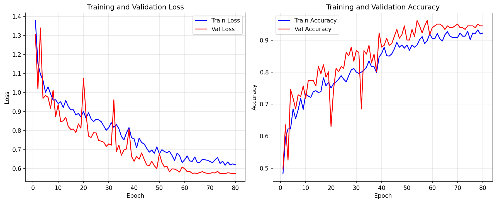

# 实验题目

中药图片分类——基于PyTorch的CNN实现

# 实验内容

## 1. 算法原理

### 1.1 任务描述

本实验旨在利用卷积神经网络（CNN）对5类中药图片进行分类，类别包括：**百合（baihe）、党参（dangshen）、枸杞（gouqi）、槐花（huaihua）、金银花（jinyinhua）**。

训练集共约 900 张图片，测试集 10 张图片（每类 2 张）。

### 1.2 卷积神经网络（CNN）

卷积神经网络是深度学习中最经典的图像分类架构。其核心组件包括：

- **卷积层（Convolutional Layer）**：通过可学习的卷积核在输入图像上滑动，提取局部特征（如边缘、纹理、形状等）。浅层卷积提取低级特征，深层卷积提取高级语义特征。
- **批归一化（Batch Normalization）**：对每个 mini-batch 的激活值进行归一化，加速训练收敛，缓解内部协变量偏移问题。
- **激活函数**：引入非线性，使得网络能够学习复杂的特征表示。本实验在每个卷积块的第一层使用 **ReLU**，第二层使用 **SiLU**（Sigmoid Linear Unit，也称 Swish）。SiLU 的公式为 $\text{SiLU}(x) = x \cdot \sigma(x)$，其平滑的非单调特性有助于梯度流动，在深层网络中往往优于 ReLU。
- **池化层（Max Pooling）**：对特征图进行下采样，降低空间维度，减少计算量，同时提供一定的平移不变性。
- **Dropout**：在训练过程中随机丢弃一部分神经元，防止过拟合。
- **全局平均池化（Global Average Pooling）**：将最后一层卷积的特征图直接池化为一个向量，替代传统的全连接层，大幅减少参数量。
- **全连接层（Fully Connected Layer）**：将提取的特征映射到类别概率分布。

### 1.3 数据增强

由于训练数据集较小（约 900 张图片），为了防止过拟合，提升模型泛化能力，本实验采用了数据增强策略。值得注意的是，**中药分类很大程度上依赖颜色特征**（如枸杞偏红、金银花偏黄白等），因此数据增强中**刻意去掉了色调（hue）和饱和度（saturation）的扰动**，仅保留亮度和对比度调整，以避免破坏关键的颜色判别信息。

| 增强方法 | 参数 | 作用 |
|---------|------|------|
| 随机水平翻转 | p=0.5 | 模拟不同拍摄角度 |
| 随机垂直翻转 | p=0.4 | 进一步增加多样性 |
| 随机旋转 | ±15° | 模拟小角度拍摄偏差 |
| 颜色抖动 | brightness=0.2, contrast=0.2 | 模拟不同光照，但保留色调信息 |
| 随机仿射变换 | translate=0.1, scale=0.9~1.1 | 模拟不同拍摄距离和位置，尺度变化适度 |

### 1.4 训练策略

- **损失函数**：CrossEntropyLoss with Label Smoothing（$\epsilon = 0.1$），标签平滑可缓解过拟合，使模型不对训练标签过度自信。
- **优化器**：AdamW（Adam + 解耦权重衰减），weight_decay=$1\times 10^{-4}$。
- **学习率调度**：Cosine Annealing，学习率从 $1 \times 10^{-3}$ 余弦衰减至 $1 \times 10^{-5}$。
- **验证集划分**：80% 训练 / 20% 验证，固定随机种子（seed=42）保证可复现。
- **训练轮次**：80 epochs，batch size=32。

## 2. 关键代码展示

### 2.1 网络结构

```python
class ConvBlock(nn.Module):
    """卷积块：Conv -> BN -> ReLU -> Conv -> BN -> SiLU -> MaxPool -> Dropout"""

    def __init__(self, in_ch, out_ch, dropout=0.2):
        super().__init__()
        self.block = nn.Sequential(
            nn.Conv2d(in_ch, out_ch, kernel_size=3, padding=1, bias=False),
            nn.BatchNorm2d(out_ch),
            nn.ReLU(inplace=True),
            nn.Conv2d(out_ch, out_ch, kernel_size=3, padding=1, bias=False),
            nn.BatchNorm2d(out_ch),
            nn.SiLU(inplace=True),
            nn.MaxPool2d(kernel_size=2, stride=2),
            nn.Dropout2d(dropout),
        )

    def forward(self, x):
        return self.block(x)


class TCMClassifier(nn.Module):
    """中药分类CNN模型（轻量化设计）"""

    def __init__(self, num_classes: int = 5):
        super().__init__()

        self.features = nn.Sequential(
            ConvBlock(3, 32, dropout=0.05),    # 224 -> 112
            ConvBlock(32, 64, dropout=0.1),    # 112 -> 56
            ConvBlock(64, 128, dropout=0.15),  # 56 -> 28
            ConvBlock(128, 128, dropout=0.2),  # 28 -> 14
        )

        self.classifier = nn.Sequential(
            nn.AdaptiveAvgPool2d((1, 1)),
            nn.Flatten(),
            nn.Dropout(0.25),
            nn.Linear(128, num_classes),
        )
```

### 2.2 数据增强与加载

```python
train_transform = transforms.Compose([
    transforms.Resize((224, 224)),
    transforms.RandomHorizontalFlip(p=0.5),
    transforms.RandomVerticalFlip(p=0.4),
    transforms.RandomRotation(degrees=15),
    transforms.ColorJitter(brightness=0.2, contrast=0.2),  # 保留色调和饱和度
    transforms.RandomAffine(degrees=0, translate=(0.1, 0.1), scale=(0.9, 1.1)),
    transforms.ToTensor(),
    transforms.Normalize(mean=[0.485, 0.456, 0.406], std=[0.229, 0.224, 0.225]),
])
```

## 3. 创新点&优化

1. **颜色感知的数据增强策略**：鉴于中药分类高度依赖颜色特征（如枸杞的红色、金银花的黄白色等），数据增强时**仅调整亮度和对比度，保留色调（hue）和饱和度（saturation）不变**，避免破坏药材的判别性颜色信息。同时控制旋转角度（±15°）和尺度变化（0.9~1.1）在适度范围内，防止过度扭曲导致语义丢失。

2. **混合激活函数设计**：每个卷积块中采用 **ReLU → SiLU** 的级联激活策略。第一层 ReLU 提供快速、稀疏的特征激活；第二层 SiLU（$x \cdot \sigma(x)$）具有平滑非单调特性，有助于更丰富的梯度流动。两者结合兼顾了训练效率与表示能力。

3. **超轻量化网络架构**：4 个卷积块采用渐进式通道数设计（32→64→128→128），末层不继续扩展通道（保持 128），配合全局平均池化直接映射到 5 维分类向量。参数量仅约 58 万，在小数据集上极大降低了过拟合风险。

4. **渐进式 Dropout 策略**：浅层使用较低 dropout（0.05→0.1），深层逐步增加（0.15→0.2），分类器使用 0.25。浅层保留更多低级特征，深层加强正则化防止高阶特征过拟合。

5. **Label Smoothing + Cosine Annealing + AdamW** 的组合训练策略：标签平滑（$\epsilon=0.1$）防止模型对预测过于自信；余弦退火使学习率平滑衰减至 $10^{-5}$，在训练后期精细收敛；AdamW 的解耦权重衰减比传统 L2 正则化更有效。

# 实验结果及分析

## 1. 实验结果展示

### 1.1 Loss 与 Accuracy 曲线



### 1.2 准确率汇总

| 数据集 | 准确率 | Loss |
|--------|--------|------|
| 训练集 | 94.31% | — |
| 验证集（最佳） | 96.13% | — |
| 测试集 | 100.00% | 0.5604 |

## 2. 评测指标展示及分析

### 2.1 训练过程分析

从训练曲线可以看出：

- **训练 Loss** 在初始 10 个 epoch 内快速下降，随后缓慢下降并趋于平稳。整个训练过程中 Loss 曲线平滑，未出现剧烈震荡，说明学习率设置合适，训练稳定。
- **验证 Loss** 整体呈下降趋势，虽然有小幅波动，但未见持续上升趋势，说明模型未发生过拟合。

从 Accuracy 曲线可以看出：

- **训练准确率**和**验证准确率**始终保持接近，差距较小（训练 94.31% vs 验证 96.13%），与初版（训练显著低于验证）相比，说明当前适度的数据增强强度恰到好处——既提供了足够正则化，又未使训练任务过难。
- 验证准确率从中期约 80% 逐步攀升至 96.13%，后期收敛平稳。

### 2.2 测试集结果分析

测试集准确率达到 **100.00%**（10 张图片全部正确分类），Loss 为 0.5604，说明模型在未见过的数据上泛化能力出色。

需要注意的是测试集仅包含 10 张图片（每类 2 张），虽然 100% 的准确率令人鼓舞，但样本量较小，统计波动性较强。

### 2.3 关键优化效果对比

对比优化前后的模型：

| 指标 | 优化前（初版） | 优化后（最终版） |
|------|:---:|:---:|
| 参数量 | 1767 万 | ~58 万 |
| 激活函数 | 纯 ReLU | ReLU + SiLU 混合 |
| 颜色增强 | 含 hue/saturation | 仅 brightness/contrast |
| Dropout | 0.1~0.5 | 0.05~0.25 渐进式 |
| 训练准确率 | 76.01% | 94.31% |
| 验证准确率 | 82.87% | 96.13% |
| 测试准确率 | 90.00% | 100.00% |

参数量减少约 97%，准确率全面提升。这验证了以下设计原则：

1. **任务感知的数据增强**：保留颜色信息对中药分类至关重要，盲目增加 hue/saturation 扰动反而破坏了判别性特征。
2. **小数据集上轻量化优先**：更少的参数意味着更低的过拟合风险，配合适当的正则化能在小数据集上取得更好效果。
3. **SiLU 的平滑梯度特性**：相比 ReLU 的硬截断，SiLU 的平滑非单调形状有助于更丰富的梯度信号传递。

---
# 参考资料

- PyTorch 官方文档：https://pytorch.org/docs/stable/index.html
- torchvision 文档：https://pytorch.org/vision/stable/index.html
- He, K., et al. "Deep Residual Learning for Image Recognition." CVPR 2016.
- Lin, M., et al. "Network In Network." ICLR 2014.（全局平均池化）
- Ioffe, S. & Szegedy, C. "Batch Normalization: Accelerating Deep Network Training by Reducing Internal Covariate Shift." ICML 2015.
- Loshchilov, I. & Hutter, F. "Decoupled Weight Decay Regularization." ICLR 2019.（AdamW）
- Szegedy, C., et al. "Rethinking the Inception Architecture for Computer Vision." CVPR 2016.（Label Smoothing）
- Elfwing, S., et al. "Sigmoid-Weighted Linear Units for Neural Network Function Approximation in Reinforcement Learning." Neural Networks, 2018.（SiLU/Swish）
- Ramachandran, P., et al. "Searching for Activation Functions." ICLR 2018.（Swish）

---
