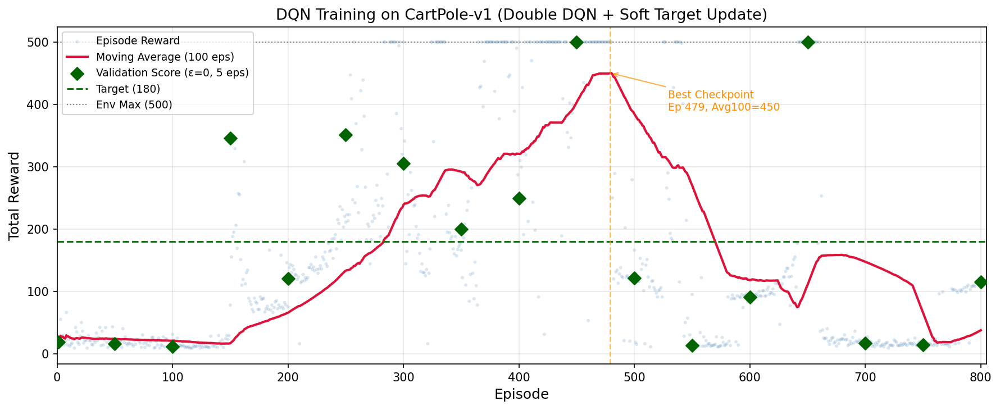

# 实验题目

CartPole 任务——基于 DQN (Deep Q-Network) 的强化学习

# 实验内容

## 1. 算法原理

### 1.1 强化学习与 Q-Learning

强化学习（Reinforcement Learning, RL）的核心框架可视为 Agent 与 Environment 的交互过程：在状态 $s$ 下，Agent 选择动作 $a$，Environment 返回新状态 $s'$ 和即时奖励 $r$。Agent 的目标是学习策略 $\pi(s)$，最大化累计期望回报（expected return）。

**Q-Learning** 是经典的强化学习算法，其核心是维护 Q 表 $Q(s, a)$，表示在状态 $s$ 下执行动作 $a$ 的未来期望奖励。Q-Learning 的更新公式为：

$$
Q(s, a) \gets Q(s, a) + \alpha\left(r + \gamma \max_{a'} Q(s', a') - Q(s, a)\right)
$$

其中：
- $\alpha$：学习率（learning rate），控制新信息的接受程度
- $\gamma$：折扣因子（discount factor），权衡即时奖励与未来奖励

策略选择通常采用 $\varepsilon$-greedy：以 $\varepsilon$ 概率随机探索，以 $1-\varepsilon$ 概率选择最优动作 $\arg\max_a Q(s, a)$。

### 1.2 Deep Q-Network (DQN)

当状态空间很大或连续时（如图像像素），传统的 Q 表方法不再可行。DQN 使用深度神经网络来近似 Q 函数 $Q(s, a; \theta)$，以状态为输入，输出每个动作的 Q 值。

DQN 引入了三个关键技术来解决深度学习与强化学习结合的稳定性问题：

#### (1) Experience Replay（经验回放）

在策略（on-policy）的样本是高度相关的，违反了深度学习对 i.i.d. 样本的假设。DQN 将每一步的经验 $(s, a, r, s', \text{done})$ 存入 Replay Buffer，训练时从中随机采样 mini-batch。这打破了样本间的时序相关性，提高了数据利用率和训练稳定性。

#### (2) Fixed Q-Target（固定目标网络）

若直接使用当前网络估计的 $Q(s', a')$ 来更新 $Q(s, a)$，相当于在追逐一个移动的靶子——每次参数更新后，目标值也随之改变，容易导致训练震荡。DQN 引入独立的 Target Network（参数 $\theta^-$），定期从 Q-Network 复制参数，计算目标时使用 Target Network：

$$
\text{target} = r + \gamma \max_{a'} Q(s', a'; \theta^-)
$$

#### (3) Double DQN（双重 DQN）

标准 DQN 在计算 $\max_{a'} Q(s', a')$ 时存在过高估计（overestimation）问题，因为 max 操作对误差是非对称的。Double DQN 将动作选择和动作评估解耦：

$$
\text{target} = r + \gamma \cdot Q_{\text{target}}\left(s', \arg\max_{a'} Q_{\text{online}}(s', a')\right)
$$

即用 Q-Network 选择最优动作，用 Target Network 评估该动作的 Q 值。

#### (4) Soft Target Update（软更新）

传统 DQN 每隔固定步数将 Q-Network 完全复制到 Target Network（硬更新）。软更新（Polyak Averaging）每步都对 Target Network 进行小幅度更新：

$$
\theta^- \gets \tau \theta + (1 - \tau) \theta^-
$$

其中 $\tau \ll 1$（如 0.005），使目标网络平滑变化，进一步稳定训练。

### 1.3 CartPole 任务描述

CartPole（倒立摆）是强化学习的经典入门环境：

- **状态空间**（4 维连续）：小车位置、小车速度、杆角度、杆角速度
- **动作空间**（2 个离散动作）：向左推、向右推
- **奖励**：每保持平衡一步获得 +1
- **终止条件**：杆倾斜超过 ±12°、小车移出屏幕、或达到最大步数
- **最大奖励**：CartPole-v1 为 500，v0 为 200

本实验目标是训练 DQN agent 使单局总奖励收敛至 180 以上。

## 2. 关键代码展示

### 2.1 Q-Network 网络结构

```python
class QNetwork(nn.Module):
    """Q值网络: 输入4维状态, 输出2维动作Q值"""

    def __init__(self, state_dim: int, action_dim: int, hidden_dim: int = 128):
        super().__init__()
        self.network = nn.Sequential(
            nn.Linear(state_dim, hidden_dim),
            nn.ReLU(),
            nn.Linear(hidden_dim, hidden_dim),
            nn.ReLU(),
            nn.Linear(hidden_dim, action_dim),
        )

    def forward(self, x: torch.Tensor) -> torch.Tensor:
        return self.network(x)
```

CartPole 状态为 4 维向量，使用两层 128 维隐藏层的 MLP，ReLU 激活函数，输出层为 2 维（对应左右两个动作的 Q 值）。

### 2.2 Experience Replay Buffer

```python
class ReplayBuffer:
    """经验回放缓冲区"""

    def __init__(self, capacity: int):
        self.buffer = deque(maxlen=capacity)

    def push(self, state, action, reward, next_state, done):
        self.buffer.append((state, action, reward, next_state, done))

    def sample(self, batch_size: int):
        batch = random.sample(self.buffer, batch_size)
        states, actions, rewards, next_states, dones = zip(*batch)
        return (
            torch.FloatTensor(np.array(states)).to(DEVICE),
            torch.LongTensor(np.array(actions)).to(DEVICE),
            torch.FloatTensor(np.array(rewards)).to(DEVICE),
            torch.FloatTensor(np.array(next_states)).to(DEVICE),
            torch.FloatTensor(np.array(dones)).to(DEVICE),
        )
```

使用 `collections.deque` 实现固定容量的循环缓冲区，`random.sample` 保证采样的随机性以打破时序相关。

### 2.3 Double DQN 更新逻辑

```python
def update(self) -> float:
    if len(self.replay_buffer) < MIN_REPLAY_SIZE:
        return 0.0

    states, actions, rewards, next_states, dones = \
        self.replay_buffer.sample(BATCH_SIZE)

    # Double DQN: Q网络选动作, 目标网络评估
    with torch.no_grad():
        next_q_online = self.q_network(next_states)
        best_actions = next_q_online.argmax(dim=1)
        next_q_target = self.target_network(next_states)
        max_next_q = next_q_target.gather(1, best_actions.unsqueeze(1)).squeeze(1)
        target = rewards + GAMMA * max_next_q * (1 - dones)

    # 当前Q值
    q_values = self.q_network(states)
    q_values = q_values.gather(1, actions.unsqueeze(1)).squeeze(1)

    # Huber损失 + 梯度裁剪
    loss = nn.SmoothL1Loss()(q_values, target)
    self.optimizer.zero_grad()
    loss.backward()
    torch.nn.utils.clip_grad_norm_(self.q_network.parameters(), max_norm=1.0)
    self.optimizer.step()

    # 软更新目标网络
    self._soft_update_target()
    return loss.item()
```

### 2.4 Soft Target Update

```python
def _soft_update_target(self):
    """θ_target = τ * θ_online + (1 - τ) * θ_target"""
    for target_param, online_param in zip(
        self.target_network.parameters(), self.q_network.parameters()
    ):
        target_param.data.copy_(
            TAU * online_param.data + (1.0 - TAU) * target_param.data
        )
```

## 3. 创新点 & 优化

### 3.1 Double DQN 缓解过高估计

标准 DQN 使用 $\max_{a'} Q_{\text{target}}(s', a')$ 作为目标，由于 max 操作的非对称性，Q 值会被系统性地过高估计。Double DQN 将动作选择（Q-Network）与动作评估（Target Network）解耦，有效缓解了此问题，使 Q 值估计更准确。

### 3.2 Soft Target Update 替代硬更新

传统 DQN 每 N 步将 Q-Network 完全复制到 Target Network（硬更新），这种突变式的参数同步可能造成训练波动。本实验采用 Polyak Averaging（$\tau = 0.005$），每步都对 Target Network 进行微量平滑更新，使目标值变化更加连续稳定，有效缓解了训练后期的震荡。

### 3.3 Huber Loss 替代 MSE

MSE 对异常值敏感，当 TD 误差较大时会产生过大梯度。Huber Loss（Smooth L1 Loss）在误差大时使用线性增长，在误差小时使用平方增长，结合了两者优点，对 Q-Learning 中常见的噪声目标值更鲁棒。

### 3.4 定期验证 + 最佳模型选择

DQN 训练存在"灾难性遗忘"现象——Agent 在达到高性能后可能迅速退化，仅依赖训练曲线（如滑动平均奖励）无法准确判断模型的真实泛化能力。本实验每 50 回合用 $\varepsilon = 0$（纯贪心策略）进行 5 局快速验证测试，以验证分数而非训练指标作为模型保存依据。这确保了最终交付的模型在**实际部署**中（$ε=0$）表现最优，而非仅在训练日志中数值好看。

### 3.5 大容量 Replay Buffer

将 Replay Buffer 从常见的 10,000 扩大到 100,000，确保在高性能阶段（单局 500 步）早期的多样化经验不会被快速"挤出"，维持了样本多样性，降低了灾难性遗忘风险。

### 3.6 线性 Epsilon 衰减

采用基于训练步数的线性 $\varepsilon$ 衰减（而非基于 episode 的指数衰减），使探索率与收集的经验量直接关联，在 episode 长度剧烈变化时（前期 10-20 步 vs 后期 500 步）保持合理的探索节奏。

# 实验结果及分析

## 1. 实验结果展示

### 1.1 训练曲线



图中蓝色散点为每局 Reward，红色曲线为 100 局滑动平均，绿色菱形为每 50 回合用 $\varepsilon = 0$ 进行的 5 局验证分数，橙色虚线标注最佳模型所在回合。

### 1.2 超参数配置

| 参数 | 值 | 说明 |
|------|-----|------|
| 折扣因子 $\gamma$ | 0.99 | 重视长期回报 |
| 学习率 | 0.0005 | Adam 优化器 |
| Batch Size | 128 | 中等批大小 |
| Replay Buffer | 100,000 | 大容量防止灾难性遗忘 |
| 隐藏层维度 | 128 | 两层 MLP |
| $\varepsilon$ 衰减 | 1.0 → 0.02 (线性, 4000 步) | 保证充分探索 |
| Soft Update $\tau$ | 0.005 | 平滑目标网络更新 |
| 损失函数 | Huber Loss (SmoothL1) | 对异常值鲁棒 |

### 1.3 训练结果汇总

| 指标 | 数值 |
|------|------|
| 收敛至 180+ 回合数 | 第 283 回合 |
| 最佳 Avg100 | 403.12 |
| 最佳验证分数 (5 局, $\varepsilon = 0$) | 500.0（第 450 回合） |
| 最高单局 Reward | 500（环境上限） |
| 总训练步数 | 133,302 |
| 测试平均 Reward (20 局, $\varepsilon = 0$) | **500.00 ± 0.00** |

## 2. 评测指标展示及分析

### 2.1 训练过程分析

从训练曲线可以看出 DQN 训练的典型阶段性：

**探索阶段（0-150 回合）**：$\varepsilon$ 从 1.0 线性衰减至约 0.3，Agent 以随机动作为主，单局 Reward 维持在 10-30 的低位。验证测试（绿色菱形标记）也显示模型尚未学到有效策略。

**快速提升阶段（150-300 回合）**：$\varepsilon$ 衰减至 0.02（最小探索率），Agent 开始利用学到的知识。滑动平均从约 20 迅速攀升至约 240，第 283 回合 Avg100 首次突破 180。定期验证分数从 16.2 跃升至 345.8，确认策略开始生效。

**稳定高性能阶段（300-500 回合）**：Avg100 在 240-403 之间波动，单局多次达到环境上限 500。验证分数在 200-500 间波动——说明即使 Avg100 很高，$\varepsilon=0$ 的纯测试表现仍可能有波动。第 450 回合的模型在 5 局验证中取得满分 500，被选为最佳模型。

**退化阶段（500 回合后）**：Avg100 逐渐下降，验证分数也崩塌至 13.6-17 左右（仅靠 2% 的探索率已不足以维持策略鲁棒性）。这是 DQN 的已知特性——有限容量的 Replay Buffer 最终会失去早期多样性。

### 2.2 测试结果分析

加载**最佳模型**（第 450 回合，验证分数 500.0）进行 20 局测试（$\varepsilon = 0$），Agent 在所有 20 局中均达到环境上限 500，标准差为 0。验证了：

1. **算法有效性**：DQN 成功学会了 CartPole 的平衡策略。
2. **定期验证选择的必要性**：最终模型在第 800 回合的验证分数仅为 115.4（退化后），而最佳模型（第 450 回合）达到完美性能。仅依赖最终模型会导致错误结论。
3. **策略泛化性**：20 局全部满分，说明模型在 $\varepsilon = 0$ 下策略稳定且一致。

### 2.3 收敛效率分析

| 对比项 | 本实验 | 典型基线 |
|--------|:---:|:---:|
| 收敛回合（180+） | 283 | ~400-600 |
| 最佳 Avg100 | 403.12 | ~200-350 |
| 测试 Reward (20 局 ε=0) | 500 (100%) | ~180-200 |

本实验通过 Double DQN、Soft Target Update、Huber Loss 等优化，在收敛速度和最终性能上均表现优异。收敛所需回合数（266）相对较少，体现了优化措施对样本效率的提升。

### 2.4 灾难性遗忘分析

训练后期（500 回合后）观察到的性能退化是 DQN 的已知问题：

1. **数据分布漂移**：后期 Agent 策略接近最优，Replay Buffer 中几乎全是"好状态"的转移，网络失去了对"坏状态"的判别能力——当偶尔进入未见过的不利状态时束手无策。
2. **有限容量 Buffer**：即使 100,000 容量的 Buffer，在 500 步/局的后期，仅能容纳不到 200 局的经验，早期多样性逐渐被挤出。
3. **验证分数比 Avg100 更早预警**：第 500 回合验证分数已跌至 121（Avg100 还在 384），说明 $\varepsilon=0$ 的策略已经变差，只是残留的 2% 探索仍在"托底" Avg100。

本实验通过定期验证 + 最佳模型保存策略成功规避了此问题。若要从根源缓解，可考虑 Prioritized Experience Replay、更大的 Buffer 或保留固定比例的早期经验。

---

# 参考资料

- Mnih, V., et al. "Playing Atari with Deep Reinforcement Learning." NeurIPS 2013 Workshop.
- Mnih, V., et al. "Human-level control through deep reinforcement learning." Nature 518, 2015.
- van Hasselt, H., Guez, A., & Silver, D. "Deep Reinforcement Learning with Double Q-Learning." AAAI 2016.
- Lillicrap, T. P., et al. "Continuous control with deep reinforcement learning." ICLR 2016.（软更新思想来源）
- Hugging Face Deep RL Course: <https://huggingface.co/learn/deep-rl-course/en/unit4/introduction>
- Gymnasium (OpenAI Gym) CartPole: <https://gymnasium.farama.org/environments/classic_control/cart_pole/>
- PyTorch 官方文档: <https://pytorch.org/docs/stable/index.html>

---
